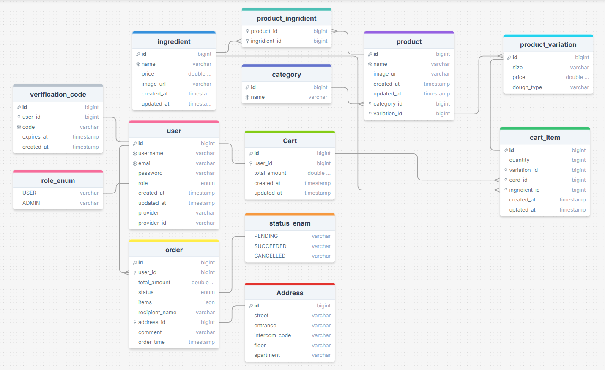

# NextPizza 🍕

Modern pizza delivery platform built with microservices architecture.

## 🛠 Tech Stack

### Backend
- **Language**: Java 21
- **Framework**: Spring Boot (Web, Data JPA, Security, Cloud)
- **Architecture**: Microservices
- **Messaging**: Apache Kafka
- **Caching**: Redis

### Database
- **Primary DB**: PostgreSQL
- **Migrations**: Flyway

### Infrastructure
- **Containerization**: Docker
- **Orchestration**: Docker Compose

### Utilities
- **Code Generation**: Lombok
- **Logging**: SLF4J + Logback
- **Testing**: JUnit 5, Mockito, Testcontainers

## 🗄 Database Schema



## Architecture Diagram


## 🚀 Quick Start

```bash
# Run with Docker
docker-compose up --build